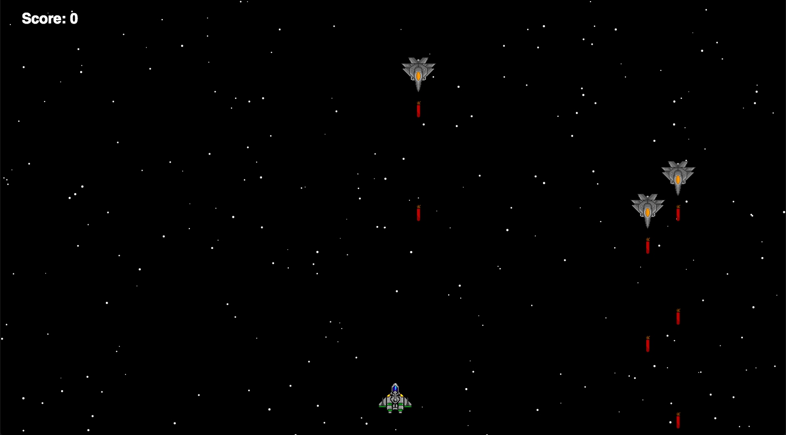

# Space Ship Game

This game develop using rxJs.

## Build
- `yarn` - install
- `yarn run build` or `yarn run start` for development

## Files
-  `canvas` - class which initialize a Canvas
- `const` - contain constants
- `models` - contain all necessary models ( `IPoint`, `IStar`, `Enemy`)
- `util` - class with util functions
- `index` - main application file which initialize a Canvas, Util and run the game

## How to use the game

For start a game open your browser http://localhost:9000/ and click on the screen.

